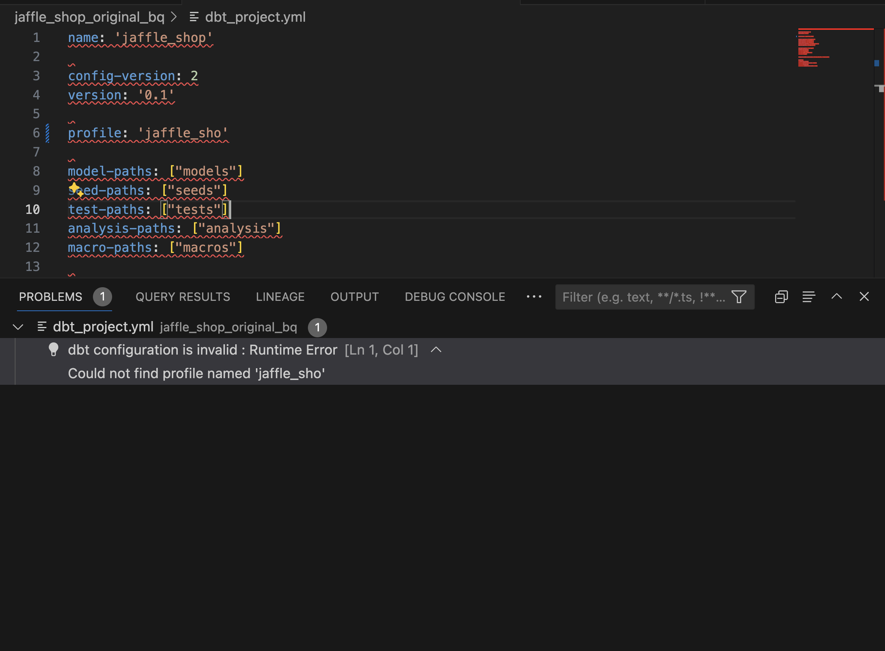
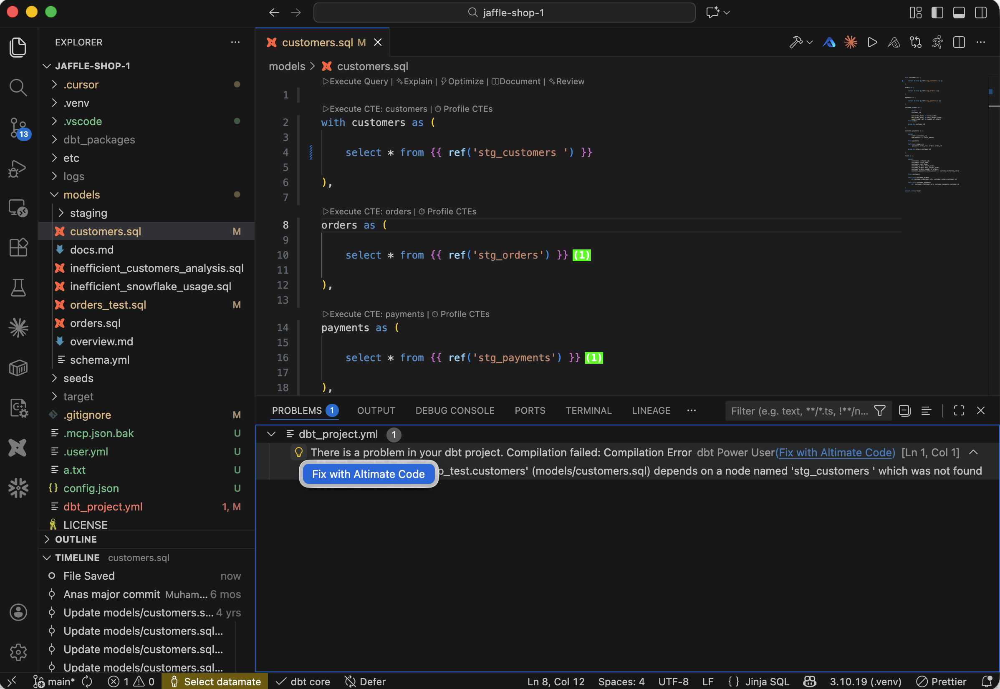
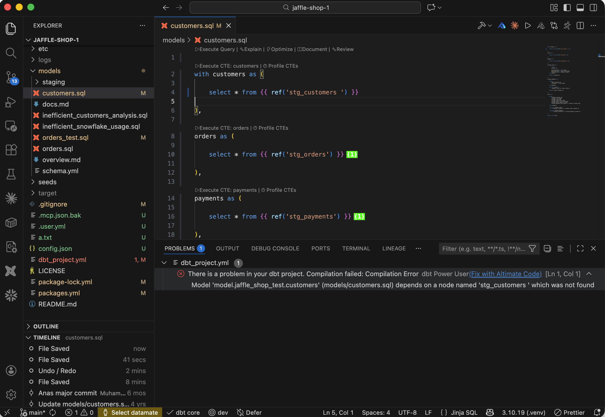
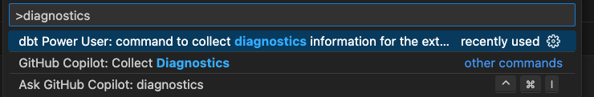
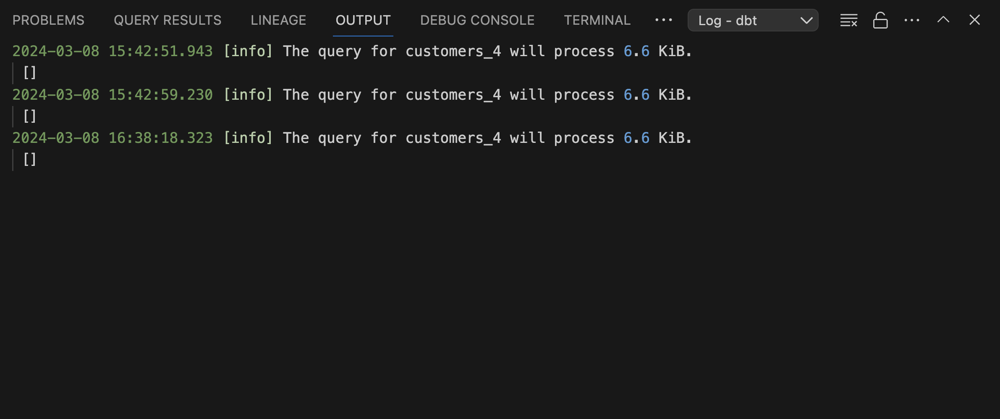
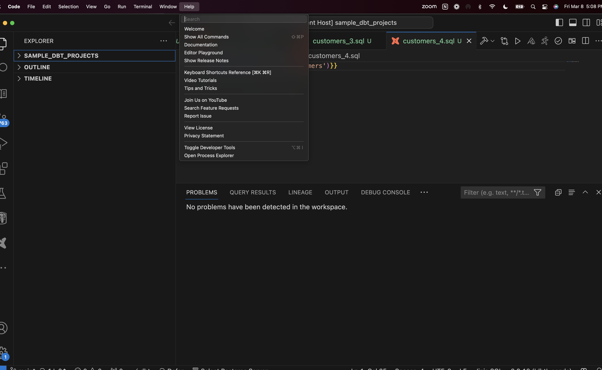

## Troubleshooting Steps

Follow these steps to effectively troubleshoot and resolve issues with the extension:

### Get Started panel (recommended)

The fastest way to detect and resolve environment issues is the **Get Started with dbt Power User** panel. It runs through every prerequisite the extension needs — Python interpreter, dbt installation, dbt project detection, dbt deps, and database connection — and flags exactly what's missing.

Open it from the command palette:

- macOS: `Cmd + Shift + P`
- Windows / Linux: `Ctrl + Shift + P`
- Type `Get Started with dbt Power User` and run it.

You can also launch it from the **Project Actions ✨** view in the dbt Power User side panel, or by clicking the **dbt** status item in the bottom status bar and choosing "Setup Extension".

/// admonition | Demo from an earlier UI
    type: warning

The recording below was captured before the status-bar "Setup Extension" wizard was replaced by the **Get Started with dbt Power User** panel. The steps are the same — only the panel UI has changed.
///

<iframe src=https://app.supademo.com/embed/clph7wqbu4xjbpe69qnl0m9pf frameborder="0" webkitallowfullscreen="true" mozallowfullscreen="true" allowfullscreen style="position: absolute; top: 0; left: 0; width: 100%; height: 100%;"></iframe>

### Detect Python from terminal

If the extension is using the wrong Python interpreter (e.g. it sees a global Python without dbt instead of your activated virtualenv), you can have it pick up the interpreter from an open terminal:

1. Open a terminal in VS Code with your dbt environment activated (e.g. `source .venv/bin/activate`, `conda activate myenv`, or `poetry shell`).
2. Open the command palette and run **`Detect Python from terminal`**.

The extension reads the active Python path directly from the shell and switches to it. This is the quickest fix for the most common "dbt not found" / "wrong dbt version" issues.

/// admonition | Requires shell integration
    type: info

The command needs VS Code's terminal shell integration to read the Python path from your shell. If no terminal is open or shell integration is not active, the extension will prompt you to open one.
///

### Problems Panel

Open the **Problems** tab (View → Problems, or `Cmd+Shift+M` / `Ctrl+Shift+M`) to see every error and warning the extension and other tools have raised for the open workspace.

#### Fix with Altimate Code (any error row)

Every error row in the Problems panel carries a 💡 light-bulb button. Click it to open the **Quick Fix** dropdown and pick **Fix with Altimate Code** — this routes the error (file path, code, and message) to the Altimate Code chat panel, pre-filled and auto-sent.

The light-bulb is registered by the bundled **Datamates** extension (`altimateai.vscode-altimate-mcp-server`), so it appears on errors from any source — TypeScript, Python, ESLint, dbt YAML, SQL, dbt Power User itself.

#### Inline `Fix with Altimate Code` link on extension diagnostics

For diagnostics created by the dbt Power User extension itself, a clickable **Fix with Altimate Code** text link is rendered directly in the Problems panel row — no light-bulb hover needed. This currently covers:

- Python bridge errors
- dbt manifest / rebuild errors
- `dbt_project.yml` config errors
- YAML parse errors
- Validate SQL errors

Clicking the link opens the Altimate Code chat with the same pre-filled context. The first click shows VS Code's one-time **"Always Allow"** popup for the deep-link — accept it once and subsequent clicks are silent.

/// admonition | Works in VS Code, Cursor, and Windsurf
    type: info

The deep-link uses `vscode.env.uriScheme` to pick the host editor's scheme automatically, so the same flow opens the right chat in VS Code, Cursor, and Windsurf without manual configuration.
///

### Diagnostics command

The diagnostics command in the VSCode Power User extension provides a comprehensive report that covers various aspects of the system and DBT project environment. Here is a summary of the diagnostics it generates:

- **Environment Variables**: Lists all the environment variables which can help in understanding the system configuration and paths that might affect the DBT operations.

- **Extension Settings**: Details the settings related to the VSCode extension, including preferences like AI keys, instance names, and various enabled or disabled features that influence how the extension behaves.

- **Python and DBT Installations**: Confirms the installation of Python and DBT, along with their paths, ensuring that these essential tools are available and correctly set up.

- **Workspace and Project Details**: Provides information about the active workspace and DBT projects, such as the version of DBT, project directory, and the first workspace path.

- **DBT Project Configuration**: Outlines the configuration for the DBT project, including adapter type and version, and paths to essential files like dbt_project.yml.

- **Connection Testing**: Tests and verifies the database connection, detailing the connection parameters and any errors encountered during the connection attempt.

- **Potential Issues and Errors**: Identifies any issues with dependencies, such as mismatches in versions of Python libraries, and provides errors encountered during the execution of the DBT commands.
  Overall, the diagnostics command is designed to help users quickly assess and troubleshoot their DBT setup within VSCode by providing detailed insights into configuration, environment, and connection status.

Running the command

- On Mac, press `Cmd + Shift + P` or On Windows/Linux, use `Ctrl + Shift + P`
- type diagnostics and pick the option listed under the dbt power user extension name and press enter
  
- this should start a terminal window and print the diagnostic information

### Check Extension Logs

If the problem persists, examine the logs in the IDE's output panel.

1. Select `Log -> dbt` from the dropdown menu to view detailed extension logs, which can provide insights into underlying issues.
2. To access more detailed logs, you can change the log level to "Debug":
   - Open the vscode command palette -
     - On Mac, do this by pressing `Cmd + Shift + P`.
     - On Windows/Linux, use `Ctrl + Shift + P`.
   - Once the command palette opens, type `Set Log Level`, then choose `Debug`.
3. Run the operations again and you should start seeing debug logs in the `Log -> dbt` output stream

   

### Developer Tools

For more in-depth diagnostics, use the developer tools in Visual Studio Code (VSCode). Navigate to `Help -> Toggle Developer Tools` to access these tools, including a console with detailed logs and error messages.

### Contact Support

If issues still remain unresolved, please [contact us](https://www.altimate.ai/support) via Slack or chat for further assistance.

/// admonition | Feedback Widgets
    type: tip

There are also feedback widgets in the extension embedded in various features, where you can directly provide feedback on the roadmap or any issues that you encountered.
///

/// admonition | Still stuck? [contact us](https://www.altimate.ai/support) via Slack or chat
    type: tip
///
