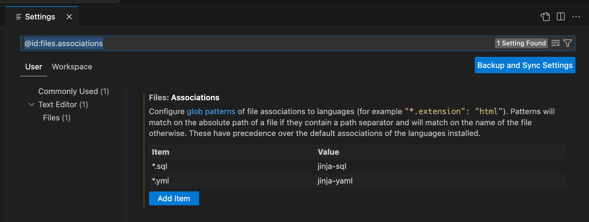

# Associate your .sql files the jinja-sql language

For dbt Power User to work, \*.sql file types need to be associated with the value 'sql' or 'jinja-sql' and \*.yml file types should be associated with the value 'yaml' or 'jinja-yaml'



or add the following in settings.json:

```
    "files.associations": {
        "*.sql": "jinja-sql",
        "*.yml": "jinja-yaml"
    },
```
