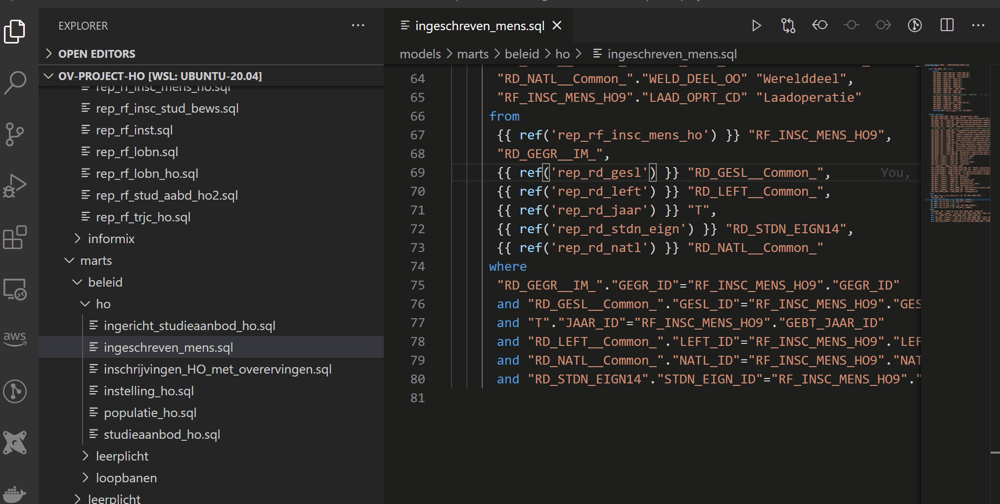

#### After your model is ready, instead of typing commands, just click to build and run parent / children models as well as tests.

#### Note: there is also a toolbar on the right section of file, that can be used for performing many operations like build or run models, query preview etc.
