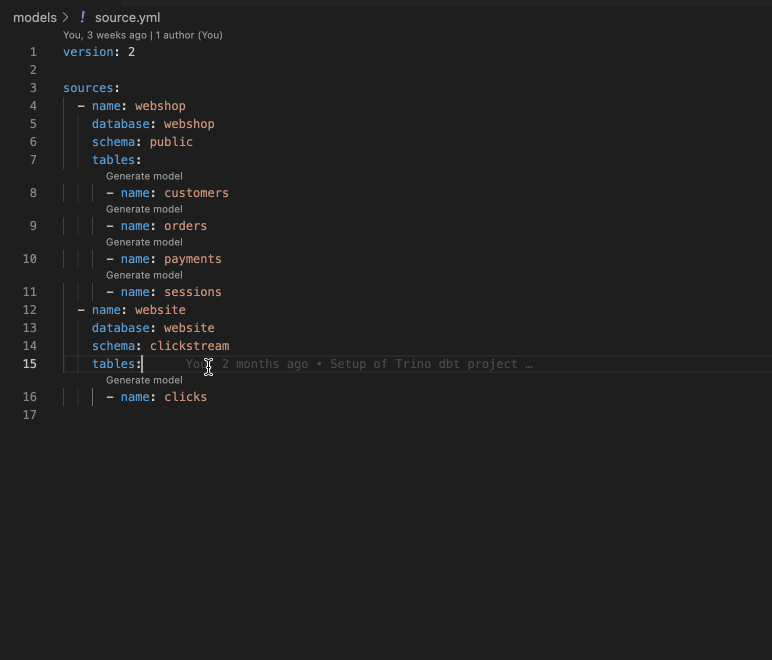

#### Start by generating a new dbt model from source files or SQL

Note: You can configure a file name template and prefix in the extension settings

#### [Coming Soon] You can also convert existing SQL to dbt model

