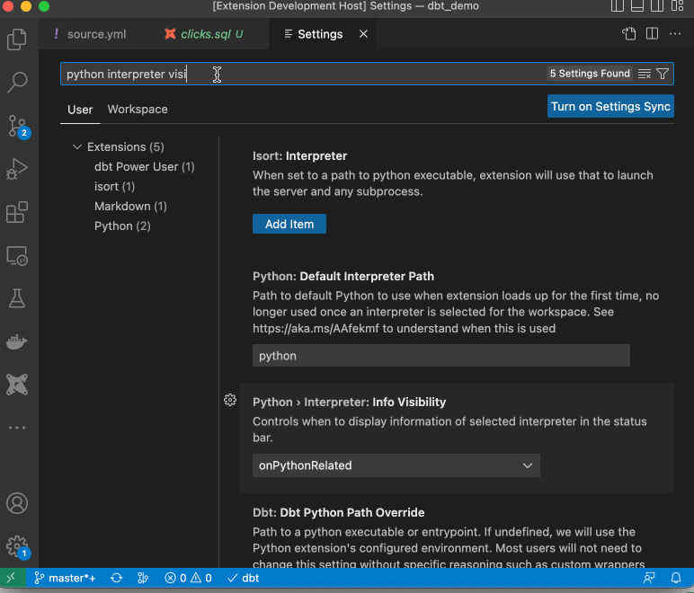

# Setup Python Interpreter

Ensure that the Python interpreter selection is always visible for ease of use:

Make sure that you select the interpreter that has dbt installed. In my case it is virtual environment in the project itself.

Avoid using the setting `dbt.dbtPythonPathOverride` unless using Meltano, the extension depends on the Python interpreter for visual code compatible environment variable parsing.

When you set the Python interpreter, the extension will try to detect dbt and you should be able to make use of the features listed below.
