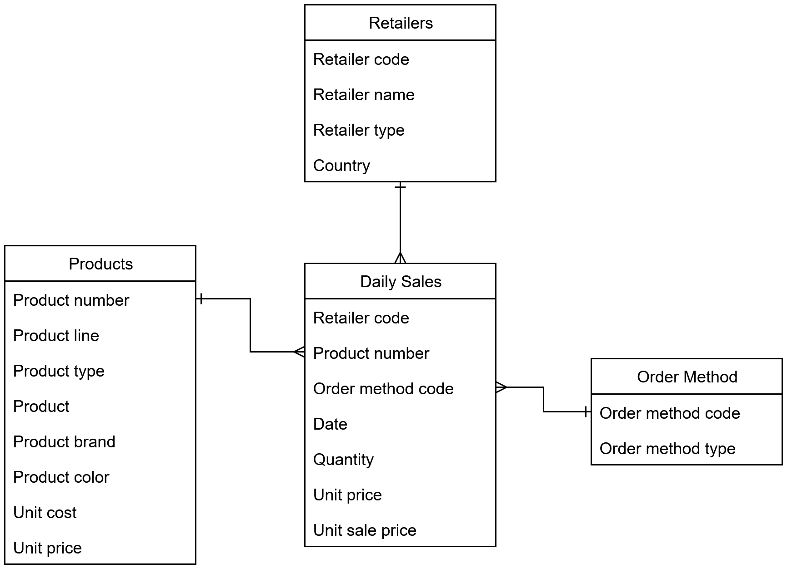
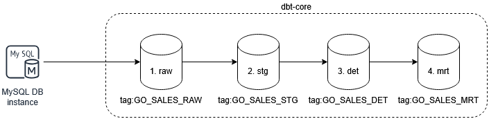

[](https://github.com/manz01/dbt-core-sample-duckdb/actions/workflows/gosales_ci_pylint.yml)
[](https://github.com/manz01/dbt-core-sample-duckdb/actions/workflows/gosales_ci_sonarcloud.yml)
<br>


> **_NOTE:_** ✅ **CI/CD Integration**: This repository now includes static code analysis via [Pylint](https://pylint.pycqa.org/) and quality gate validation via [SonarCloud](https://sonarcloud.io/summary/new_code?id=manz01_dbt-core-sample-duckdb)..


# Go Sales 🦆 DuckDB dbt Sample Project

This repository contains a sample dbt project that demonstrates how to model and transform the GO Sales IBM sample data using dbt (data build tool) with DuckDB as the database engine.

### Document Control

| Version | Date       | Author       | Description of Change            |
| ------- | ---------- | ------------ | -------------------------------- |
| 1.0     | 2025-05-18 | Manzar Ahmed | Initial Version                  |
| 1.1     | 2025-06-12 | Manzar Ahmed | Added DET and MRT model sections |
| 1.2     | 2025-06-22 | Manzar Ahmed | Added section with dbt docs      |
| 1.3     | 2025-06-23 | Manzar Ahmed | Added section High level design  |
| 1.4     | 2025-07-23 | Manzar Ahmed | Added section Low level design   |

## Table of Content

<div class="alert alert-block alert-info" style="margin-top: 20px">

1. [Background](#1)<br>
2. [High Level Design](#2)<br>
3. [Run dbt Models](#3)<br>
   3.1. [Raw Models](#31)<br>
   3.2. [Staging Models](#32)<br>
   3.3. [Detailed Models (DET)](#33)<br>
   3.4. [Mart Models (MRT)](#34)<br>
4. [Visualise Lineage with dbt Docs](#4)<br>
5. [Low-Level Design (LLD)](#5)<br>
5.1.1. [Models - raw layer](#511)<br>
5.1.2. [Models - stg layer](#512)<br>
5.1.3. [Models - det layer](#513)<br>
5.1.4. [Models - mrt layer](#514)<br>
5.1.5. [Macros](#515)<br>
5.1.6. [Python Utils](#516)<br>
</div>
<hr>

> NOTE: This sample project utlizes the [GO Sales IBM sample data](https://dataplatform.cloud.ibm.com/exchange/public/entry/view/dcf7b09bd340e6ff9a2d1869631f3753) to demonstrate dbt modeling techniques. It is designed to be run with DuckDB as the database engine, but can be adapted for other engines like Snowflake, BigQuery, or Redshift with minor modifications to the dbt profiles and SQL syntax. The GO Sales dataset is a fictional retail dataset that simulates sales operations for a global retailer, and available under the MIT License.

## 1. Background <a id="1"></a>

The GO Sales IBM sample data is a fictional retail dataset designed to demonstrate business analytics, reporting, and data warehousing techniques. It simulates sales operations for a global retailer and contains various interconnected tables that model business domains. A copy of the entity relationship diagram is provided below for reference.



## 2. High Level Design <a id="2"></a>

The dbt-core project follows a **layered design architecture** that systematically structures data transformations through a series of increasingly refined stages. This layered approach promotes modularity, reusability, and transparency in the data pipeline.



### Layer Breakdown:

1. **Raw Layer (`raw`)**

   - This layer ingests raw data directly from the **MySQL DB instance**.
   - It performs minimal transformation (if any), mainly focused on standardizing data types and storing source extracts as-is.

2. **Staging Layer (`stg`)**

   - This layer acts as a clean-up zone where raw data is normalized, renamed, and prepared for further transformation.
   - Typical operations include renaming columns to snake_case, handling nulls, and deduplicating rows.

3. **Detailed Layer (`det`)**
   - This is the business logic layer, where transformations are applied to derive meaningful metrics and dimensions.
   - It includes joins, surrogate key generation, Slowly Changing Dimensions (SCD), and other enrichment logic.
   - The detailed layer will build a star schema for the go sales data

```text
 +------------------+  +--------------+
 |t_dim_order_method|  |t_dim_products|
 +------------------+  +--------------+
         \              /
          \            /
           +-----------+
           |t_fct_sales|
           +-----------+
           /          \
          /            \
   +-----------+    +---------------+
   |t_dim_dates|    |t_dim_retailers|
   +-----------+    +---------------+
```

4. **Mart Layer (`mrt`)**
   - This final layer presents the data in a business-consumable format.
   - It aggregates and filters data for reporting, dashboards, and analytics use cases.

Each layer feeds into the next, ensuring that transformations are traceable and logically separated.

## 3. Run dbt Models <a id="3"></a>

This section outlines how to set up your environment and run different layers of the GO Sales dbt models using convenient shell commands.

**Create Aliases & Global Vars**

First, set the required environment variables to specify the paths for the dbt project and profile directory. Also, set the `PYTHONPATH` so that any custom Python modules within your project can be properly resolved.

```sh
export DBT_PROJ_DIR='/home/u0001/dbt-core-sample-duckdb'
export DBT_PROFILE_DIR='/home/u0001/dbt-core-sample-duckdb'
export PYTHONPATH=$DBT_PROJ_DIR
```

**Create dbt run go sales alias shorthand**

Define a shell alias to simplify running the dbt project with the correct profile and target. This avoids repeating long command strings every time you want to run a model.

```sh
alias dbt_run_go_sales='dbt run --project-dir $DBT_PROJ_DIR --profiles-dir $DBT_PROFILE_DIR --target go_sales'
```

### 3.1. Raw Models <a id="31"></a>

Run all models tagged with `GO_SALES_RAW`. These models typically ingest and prepare raw data, often performing minimal transformations.

```sh
dbt_run_go_sales --select tag:GO_SALES_RAW
```

### 3.2. Staging Models <a id="32"></a>

Run staging layer models tagged with `GO_SALES_STG`. These models clean and standardize raw data into a more analysis-ready format.

```sh
dbt_run_go_sales --select tag:GO_SALES_STG
```

### 3.3. Detailed Models (DET) <a id="33"></a>

Run detailed transformation models tagged with `GO_SALES_DET`. These models perform more complex business logic and enrichment tasks.

```sh
dbt_run_go_sales --select tag:GO_SALES_DET
```

### 3.4. Mart Models (MRT) <a id="34"></a>

Run mart layer models tagged with `GO_SALES_MRT`. These are the final outputs optimized for reporting and analytics.

```sh
dbt_run_go_sales --select tag:GO_SALES_MRT
```

## 4. Visualise Lineage with dbt Docs <a id="4"></a>

dbt provides an interactive lineage graph that visually represents how models are built from raw data through staging, transformation, and into marts. This helps developers, analysts, and stakeholders understand data dependencies and relationships.

To generate and view the lineage diagram:

**Step 1: Generate dbt docs**

```sh
dbt docs generate --project-dir $DBT_PROJ_DIR --profiles-dir $DBT_PROFILE_DIR --target go_sales
```

**Step 2: Serve dbt docs**

```sh
dbt docs serve --project-dir $DBT_PROJ_DIR --profiles-dir $DBT_PROFILE_DIR --target go_sales
```

This will start a local web server and open a browser where you can explore:

- Model-level documentation
- Column-level metadata
- Tags and descriptions
- The DAG (Directed Acyclic Graph) lineage diagram

The diagram includes paths from:

- Raw sources (e.g., t_raw_go_daily_sales)
- Through staging models (e.g., t_stg_go_daily_sales)
- Into dimensional tables (e.g., t_dim_products)
- Finally into fact and mart tables (e.g., t_fct_sales → t_mrt_sales)

The following diagram provides a visual representation of the dbt model lineage for the GO Sales project, illustrating how raw data flows through staging, dimension, fact, and mart layers:


# 5. Low-Level Design (LLD) <a id="5"></a>

## 5.1.1. Models - raw layer <a id="511"></a>

| #   | Object Name                                                                                                                                     | Object Type | Description                        |
| --- | ----------------------------------------------------------------------------------------------------------------------------------------------- | ----------- | ---------------------------------- |
| 1   | [t_raw_go_1k.py](https://github.com/manz01/dbt-core-sample-duckdb/blob/dbt-core-sample-duckdb/models/01-raw/t_raw_go_1k.py)                     | Python File | Python script for GO 1k data       |
| 2   | [t_raw_go_1k.yml](https://github.com/manz01/dbt-core-sample-duckdb/blob/dbt-core-sample-duckdb/models/01-raw/t_raw_go_1k.yml)                   | YAML File   | Metadata/config for GO 1k          |
| 3   | [t_raw_go_daily_sales.py](https://github.com/manz01/dbt-core-sample-duckdb/blob/dbt-core-sample-duckdb/models/01-raw/t_raw_go_daily_sales.py)   | Python File | Python script for daily sales data |
| 4   | [t_raw_go_daily_sales.yml](https://github.com/manz01/dbt-core-sample-duckdb/blob/dbt-core-sample-duckdb/models/01-raw/t_raw_go_daily_sales.yml) | YAML File   | Metadata/config for daily sales    |
| 5   | [t_raw_go_methods.py](https://github.com/manz01/dbt-core-sample-duckdb/blob/dbt-core-sample-duckdb/models/01-raw/t_raw_go_methods.py)           | Python File | Python script for GO methods       |
| 6   | [t_raw_go_methods.yml](https://github.com/manz01/dbt-core-sample-duckdb/blob/dbt-core-sample-duckdb/models/01-raw/t_raw_go_methods.yml)         | YAML File   | Metadata/config for GO methods     |
| 7   | [t_raw_go_products.py](https://github.com/manz01/dbt-core-sample-duckdb/blob/dbt-core-sample-duckdb/models/01-raw/t_raw_go_products.py)         | Python File | Python script for GO products      |
| 8   | [t_raw_go_products.yml](https://github.com/manz01/dbt-core-sample-duckdb/blob/dbt-core-sample-duckdb/models/01-raw/t_raw_go_products.yml)       | YAML File   | Metadata/config for GO products    |
| 9   | [t_raw_go_retailers.py](https://github.com/manz01/dbt-core-sample-duckdb/blob/dbt-core-sample-duckdb/models/01-raw/t_raw_go_retailers.py)       | Python File | Python script for GO retailers     |
| 10  | [t_raw_go_retailers.yml](https://github.com/manz01/dbt-core-sample-duckdb/blob/dbt-core-sample-duckdb/models/01-raw/t_raw_go_retailers.yml)     | YAML File   | Metadata/config for GO retailers   |

## 5.1.2. Models - stg layer <a id="512"></a>

| #   | Object Name                                                                                                                                   | Object Type | Description                          |
| --- | --------------------------------------------------------------------------------------------------------------------------------------------- | ----------- | ------------------------------------ |
| 1   | [t_dim_dates.sql](https://github.com/manz01/dbt-core-sample-duckdb/blob/dbt-core-sample-duckdb/models/02-stg/t_dim_dates.sql)                 | SQL File    | Staging logic for date dimension     |
| 2   | [t_dim_dates.yml](https://github.com/manz01/dbt-core-sample-duckdb/blob/dbt-core-sample-duckdb/models/02-stg/t_dim_dates.yml)                 | YAML File   | Metadata/config for date dimension   |
| 3   | [t_dim_order_methods.sql](https://github.com/manz01/dbt-core-sample-duckdb/blob/dbt-core-sample-duckdb/models/02-stg/t_dim_order_methods.sql) | SQL File    | Staging logic for order methods      |
| 4   | [t_dim_order_methods.yml](https://github.com/manz01/dbt-core-sample-duckdb/blob/dbt-core-sample-duckdb/models/02-stg/t_dim_order_methods.yml) | YAML File   | Metadata/config for order methods    |
| 5   | [t_dim_products.sql](https://github.com/manz01/dbt-core-sample-duckdb/blob/dbt-core-sample-duckdb/models/02-stg/t_dim_products.sql)           | SQL File    | Staging logic for products           |
| 6   | [t_dim_products.yml](https://github.com/manz01/dbt-core-sample-duckdb/blob/dbt-core-sample-duckdb/models/02-stg/t_dim_products.yml)           | YAML File   | Metadata/config for products         |
| 7   | [t_dim_retailers.sql](https://github.com/manz01/dbt-core-sample-duckdb/blob/dbt-core-sample-duckdb/models/02-stg/t_dim_retailers.sql)         | SQL File    | Staging logic for retailers          |
| 8   | [t_dim_retailers.yml](https://github.com/manz01/dbt-core-sample-duckdb/blob/dbt-core-sample-duckdb/models/02-stg/t_dim_retailers.yml)         | YAML File   | Metadata/config for retailers        |
| 9   | [t_fct_sales.sql](https://github.com/manz01/dbt-core-sample-duckdb/blob/dbt-core-sample-duckdb/models/02-stg/t_fct_sales.sql)                 | SQL File    | Staging logic for sales fact table   |
| 10  | [t_fct_sales.yml](https://github.com/manz01/dbt-core-sample-duckdb/blob/dbt-core-sample-duckdb/models/02-stg/t_fct_sales.yml)                 | YAML File   | Metadata/config for sales fact table |

---

## 5.1.3. Models - det layer <a id="513"></a>

| #   | Object Name                                                                                                                                   | Object Type | Description                             |
| --- | --------------------------------------------------------------------------------------------------------------------------------------------- | ----------- | --------------------------------------- |
| 1   | [t_dim_dates.sql](https://github.com/manz01/dbt-core-sample-duckdb/blob/dbt-core-sample-duckdb/models/03-det/t_dim_dates.sql)                 | SQL File    | Detail-layer model for date dimension   |
| 2   | [t_dim_dates.yml](https://github.com/manz01/dbt-core-sample-duckdb/blob/dbt-core-sample-duckdb/models/03-det/t_dim_dates.yml)                 | YAML File   | Metadata/config for date dimension      |
| 3   | [t_dim_order_methods.sql](https://github.com/manz01/dbt-core-sample-duckdb/blob/dbt-core-sample-duckdb/models/03-det/t_dim_order_methods.sql) | SQL File    | Detail-layer model for order methods    |
| 4   | [t_dim_order_methods.yml](https://github.com/manz01/dbt-core-sample-duckdb/blob/dbt-core-sample-duckdb/models/03-det/t_dim_order_methods.yml) | YAML File   | Metadata/config for order methods       |
| 5   | [t_dim_products.sql](https://github.com/manz01/dbt-core-sample-duckdb/blob/dbt-core-sample-duckdb/models/03-det/t_dim_products.sql)           | SQL File    | Detail-layer model for products         |
| 6   | [t_dim_products.yml](https://github.com/manz01/dbt-core-sample-duckdb/blob/dbt-core-sample-duckdb/models/03-det/t_dim_products.yml)           | YAML File   | Metadata/config for products            |
| 7   | [t_dim_retailers.sql](https://github.com/manz01/dbt-core-sample-duckdb/blob/dbt-core-sample-duckdb/models/03-det/t_dim_retailers.sql)         | SQL File    | Detail-layer model for retailers        |
| 8   | [t_dim_retailers.yml](https://github.com/manz01/dbt-core-sample-duckdb/blob/dbt-core-sample-duckdb/models/03-det/t_dim_retailers.yml)         | YAML File   | Metadata/config for retailers           |
| 9   | [t_fct_sales.sql](https://github.com/manz01/dbt-core-sample-duckdb/blob/dbt-core-sample-duckdb/models/03-det/t_fct_sales.sql)                 | SQL File    | Detail-layer model for sales fact table |
| 10  | [t_fct_sales.yml](https://github.com/manz01/dbt-core-sample-duckdb/blob/dbt-core-sample-duckdb/models/03-det/t_fct_sales.yml)                 | YAML File   | Metadata/config for sales fact table    |

---

## 5.1.4. Models - mrt layer <a id="514"></a>

| #   | Object Name                                                                                                                   | Object Type | Description                    |
| --- | ----------------------------------------------------------------------------------------------------------------------------- | ----------- | ------------------------------ |
| 1   | [t_mrt_sales.sql](https://github.com/manz01/dbt-core-sample-duckdb/blob/dbt-core-sample-duckdb/models/04-mrt/t_mrt_sales.sql) | SQL File    | Final mart model for sales     |
| 2   | [t_mrt_sales.yml](https://github.com/manz01/dbt-core-sample-duckdb/blob/dbt-core-sample-duckdb/models/04-mrt/t_mrt_sales.yml) | YAML File   | Metadata/config for mart sales |

---

## 5.1.5. Macros <a id="515"></a>

| #   | Object Name                                                                                                                | Object Type      | Description                                                               |
| --- | -------------------------------------------------------------------------------------------------------------------------- | ---------------- | ------------------------------------------------------------------------- |
| 1   | [custom_schema.sql](https://github.com/manz01/dbt-core-sample-duckdb/blob/dbt-core-sample-duckdb/macros/custom_schema.sql) | SQL (Jinja) File | Macro to dynamically assign custom schemas based on environment or config |
| 2   | [scd2_ts.sql](https://github.com/manz01/dbt-core-sample-duckdb/blob/dbt-core-sample-duckdb/macros/scd2_ts.sql)             | SQL (Jinja) File | Macro to implement SCD Type 2 logic with timestamp-based tracking         |

## 5.1.6. Python Utils <a id="516"></a>

| #   | Object Name                                                                                                            | Object Type | Description                                       |
| --- | ---------------------------------------------------------------------------------------------------------------------- | ----------- | ------------------------------------------------- |
| 1   | [`__init__.py`](https://github.com/manz01/dbt-core-sample-duckdb/blob/dbt-core-sample-duckdb/shared_utils/__init__.py) | Python File | Marks the directory as a Python package           |
| 2   | [`config.py`](https://github.com/manz01/dbt-core-sample-duckdb/blob/dbt-core-sample-duckdb/shared_utils/config.py)     | Python File | Contains shared configuration values and helpers  |
| 3   | [`db_utils.py`](https://github.com/manz01/dbt-core-sample-duckdb/blob/dbt-core-sample-duckdb/shared_utils/db_utils.py) | Python File | Utility functions for database access and queries |
