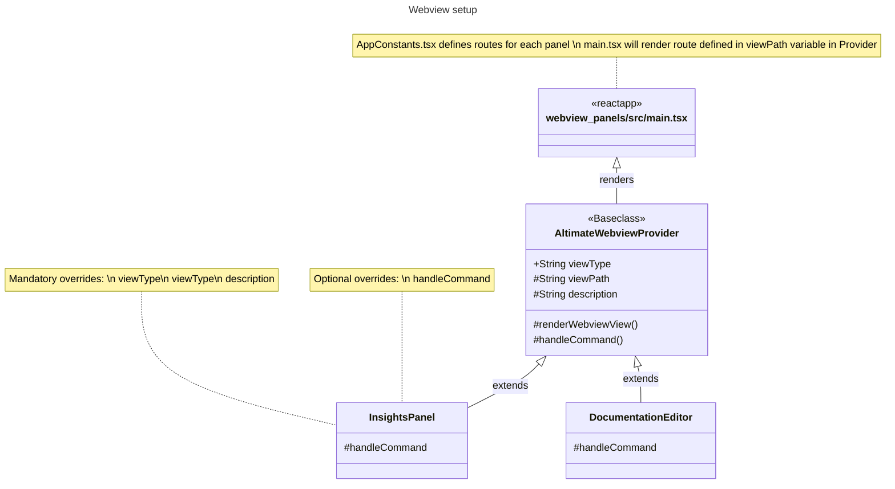

# Webview for extension

### Overview

### Setup notes

#### AltimateWebviewProvider

- base class for rendering webview
- also handles security practices like CSP and noonce as recommended [here](https://code.visualstudio.com/api/extension-guides/webview#security)
- each new panel needs to have its own provider which extends this class and should override
  - `viewPath`
  - `description`
  - `viewType`
  - each panel can also override `handleCommand` function to handle incoming messages from webview

#### webview_panels react app

- uses react-router-dom for handling different routes for each panel
- route will be determined by the `viewPath` value set in `AltimateWebviewProvider`
- uses [reduxjstoolkit](https://redux-toolkit.js.org/) with useReducer in [AppProvider](./src/modules/app/AppProvider.tsx)
  - this helps us to setup reducers in more readable and maintainable way
  - this comes with [RTK Query](https://redux-toolkit.js.org/rtk-query/overview) similar to react-query
- [requestExecutor](./src/modules/app/requestExecutor.ts) - handles sending messages to providers
  - `executeRequestInSync` can be used for getting response back from provider for an action
  - `executeRequestInAsync` can be used for just sending message to provider without need for response
- [useListeners](./src/modules/app/useListeners.ts) - common place to listen for incoming messages
  - Component specific message can be listened within component/respective hook
- assets are stored here [./src/assets](./src/assets)
  - can be accessed via `index.ts` in the same directory

### How to add new panel?

- in `package.json`, add an entry in `viewsContainers -> panel` with expected values
  - and corresponding entry in `views -> dbt_view`
- create new provider in [../src/webview_provider](../src/webview_provider) by extending `AltimateWebviewProvider` with `viewType` same as the one added in package.json above
- add the new provider in [../src/webview_provider/index.ts](../src/webview_provider/index.ts)
- add new route in [./src/AppConstants.tsx](./src/AppConstants.tsx)
- use the new view route added in AppConstants in new webview provider created in step 2 and update value for `viewPath` variable
- update the value for `panelDescription` in provider
- launch the extension and test the new panel
