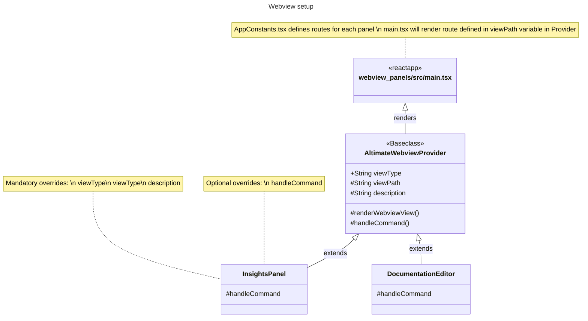

# Webview for extension

### Overview

### Setup notes

#### AltimateWebviewProvider

- Base class for rendering webview
- Also handles security practices like CSP and noonce as recommended [here](https://code.visualstudio.com/api/extension-guides/webview#security)
- Each new panel needs to have its own provider which extends this class and should override
  - `viewPath`
  - `description`
  - `viewType`
  - each panel can also override `handleCommand` function to handle incoming messages from webview

#### webview_panels react app

- Uses react-router-dom for handling different routes for each panel
- Route will be determined by the `viewPath` value set in `AltimateWebviewProvider`
- Uses [reduxjstoolkit](https://redux-toolkit.js.org/) with useReducer in [AppProvider](./src/modules/app/AppProvider.tsx)
  - This helps us to setup reducers in more readable and maintainable way
  - This comes with [RTK Query](https://redux-toolkit.js.org/rtk-query/overview) similar to react-query
- [useListeners](./src/modules/app/useListeners.ts) - common place to listen for incoming messages
  - Component specific message can be listened within component/respective hook
- Assets are stored here [./src/assets](./src/assets)
  - can be accessed via `index.ts` in the same directory

### How to add new panel?

- In `package.json`, add an entry in `viewsContainers -> panel` with expected values
  - add corresponding entry in `views -> dbt_view`
- Create new provider in [../src/webview_provider](../src/webview_provider) by extending `AltimateWebviewProvider` with `viewType` same as the one added in package.json above
- Add the new provider in [../src/webview_provider/index.ts](../src/webview_provider/index.ts)
- Add new route in [./src/AppConstants.tsx](./src/AppConstants.tsx)
- Use the new view route added in AppConstants in new webview provider created in step 2 and update value for `viewPath` variable
- Update the value for `panelDescription` in provider
- Launch the extension and test the new panel

### Guidelines

- UI components are built in [./src/uiCore](./src/uiCore/index.ts) package. Any new UI component should be imported only from this package. This will enable us to apply consistent styling, create ui toolkit and ability to switch to new UI library easily if needed
- `reactstrap` (which is the current ui library) import is restricted in components in `src/modules`, to avoid importing the ui components directly from reactstrap. Instead export the necessary component from [./src/uiCore](./src/uiCore/index.ts) and use it in components
- [Storybook](https://storybook.js.org/) is integrated and [ui tool kit](./src/uiCore/uiToolkitStories) is built in storybook to check the available UI components, typography, colors. If you add any new component to uiCore, add that component to above storybook.
- use `panelLogger` for logging from webview panels. We can make this to use console or any logger in future

### Communication with DataPilot

- From webview react app, call `postMessageToDataPilot({ test: '123' });` in `useAppContext`
- This message will be received by `altimateWebviewProvider` and posted to `SharedStateService`
- `datapilotPanel` will listen for message from `SharedStateService` and relays that to data pilot webview panel
- Datapilot storybook is available [here](./src/modules/dataPilot/DataPilot.stories.tsx)

### Making API calls

- Webview panel does not make api calls directly. Instead the request will be sent to webview providers and in turn call backend apis
- For achieving this, helper methods are available
  - [requestExecutor](./src/modules/app/requestExecutor.ts) - handles sending messages to providers
    - `executeRequestInSync` can be used for getting response back from provider for an action
    - `executeRequestInAsync` can be used for just sending message to provider without need for response
